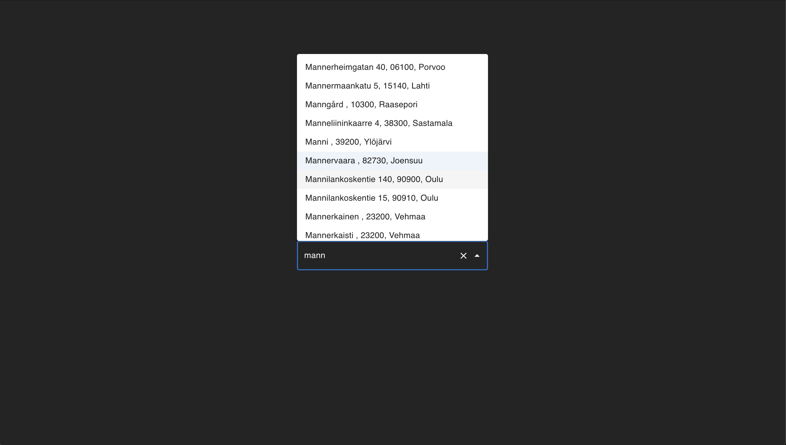

# Address Search

This is a test project to learn [OpenSearch](https://opensearch.org/), a fork of ElasticSearch. It can only be tested locally and is not deployable to any services as is.



## Data sources

Two main data sources are used:

1. Street addresses of Finland
   https://www.avoindata.fi/data/fi/dataset/postcodes
2. Municipalities of Finland
   https://stat.fi/fi/luokitukset/tupa/

## Running locally

### Requirements

- Python3
- Docker
- Ability to execute shell scripts
- nvm or Node 20

### (Optional) Get latest addresses

The project contains addresses from February of 2024. If you wish to get the latest data, go to the datasource mentioned in data source listings and download it. Put the file to `finland_addresses` folder and rename references in `csvToBulk.py` file.

Then run

```
python3 csvToBulk.py
```

### (Optional) Get latest municipalities

I got really lazy and just copied manually from `.xlsx` file to `.txt` file. To use `formatMunicipalities.py`, the manual step should be done first resulting in a file similar to `municipalities.txt`.

Then just run:

```
python3 formatMunicipalities.py
```

### Get project running

Do not edit the password as it is hardcoded in the project. Password is complex because OpenSearch didn't accept any simple passwords. Run:

```
OPENSEARCH_INITIAL_ADMIN_PASSWORD="'RQ43-3Jm&4*_D\i13sJab-2w33I9{Hb" docker compose up -d
```

Then start the frontend

```
cd frontend
nvm use (if node 20 is not in use yet)
npm install
npm start
```

### Create and populate OpenSearch index

Create an index called `addresses`

```
curl -H "Content-Type: application/x-ndjson" -X PUT "https://localhost:9200/addresses" -ku admin:"'RQ43-3Jm&4*_D\i13sJab-2w33I9{Hb" --data-binary "@finland_addresses-field_mappings.json"
```

Then, to populate the index, run:

```
./upload_to_opensearch.sh
```

Now the project should be running and you can search addresses from the UI running in `http://localhost:5173/`
